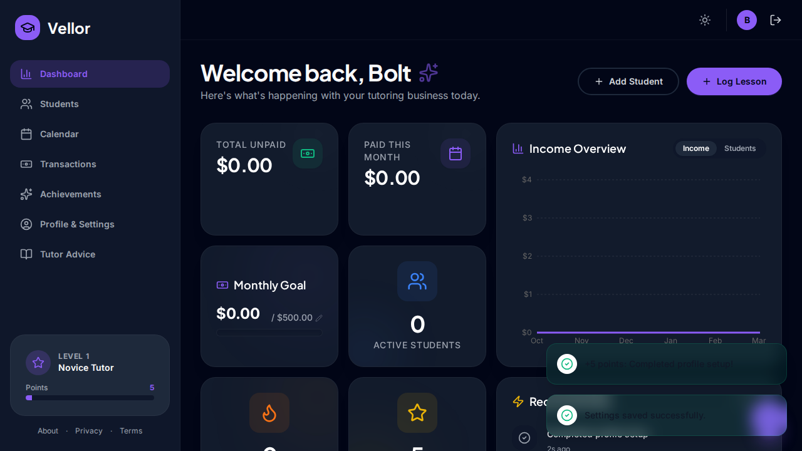

<div align="center">


# Vellor 🎓

**Manage your tutoring business like a pro.**

[](https://github.com/dhaatrik/vellor/actions/workflows/ci.yml)
[](https://github.com/dhaatrik/vellor)
[](LICENSE)
[](https://www.typescriptlang.org/)
[](https://react.dev/)
[](store/tests/)

Vellor is a free, open-source Progressive Web App built for private teachers and tutors. It provides a single, beautifully designed interface to manage students, track lessons and payments, generate invoices, and stay motivated through built-in gamification — all while keeping your data **100% private** on your own device.

[Getting Started](#-getting-started) · [Features](#-features) · [Tech Stack](#-tech-stack) · [Contributing](#-contributing)

</div>

---

<div align="center">



*Dashboard — your command center for students, income, and goals.*

</div>

---

## 📑 Table of Contents

- [Why Vellor?](#-why-vellor)
- [Features](#-features)
- [Getting Started](#-getting-started)
- [Usage](#-usage)
- [Tech Stack](#-tech-stack)
- [Project Structure](#-project-structure)
- [Available Scripts](#-available-scripts)
- [Testing](#-testing)
- [CI/CD Pipeline](#-cicd-pipeline)
- [Contributing](#-contributing)
- [Roadmap](#-roadmap)
- [License](#-license)

---

## 💡 Why Vellor?

Most tutoring management tools are either too complex, too expensive, or require handing over your data to a third-party service. Vellor was built to solve this:

| Pain Point | Vellor's Answer |
|------------|-----------------|
| Expensive SaaS | **Free & open-source** — no subscriptions, no hidden fees |
| Data privacy concerns | **Privacy-first** — all data lives in your browser's encrypted `localStorage`. Nothing leaves your device |
| Motivation burnout | **Gamified** — earn points, level up, and unlock 25+ achievements to stay motivated |
| Complex setup | **Zero-config** — runs instantly in any modern browser, installable as a PWA |

---

## ✨ Features

### 🚀 The Tutor OS Update (v4.0)

Vellor has evolved into a complete operating system for private educators with 7 major capabilities:

- **WhatsApp Integration** — One-click, pre-filled WhatsApp reminders for overdue payments directly from the dashboard.
- **Automated Monthly Invoicing** — Generate comprehensive, multi-page PDF statements for all unpaid lessons with a single click.
- **Secure Client Portals** — Generate read-only Base64 URL snapshots of a student's progress and attendance to share with parents instantly.
- **Financial Forecasting** — Dynamic charts predicting your future monthly income based on scheduled lessons and active student rates.
- **Smart Rescheduling** — Automatically prompts and pre-fills the make-up class scheduler whenever a student is marked as "Absent" or "Cancelled".
- **White-Label Customization** — Upload your own brand logo and set a custom accent color that dynamically themes the entire UI and PDF invoices.
- **Enhanced Offline Engine** — Seamlessly detects network drops with UI indicators and proactively reminds you to backup data upon reconnecting.

### ⚡ Power-Tutor Essentials

- **Guided Onboarding Wizard** — A beautiful 4-step interactive walkthrough for new users.
- **Push Notifications** — Automated local lesson reminders sent directly to your device.
- **PWA Install Prompt** — Persistent prompts to install Vellor as a native app for a seamless offline experience.
- **Bulk Actions** — Manage, archive, clear debts, or delete multiple students at once.
- **Branded PDF Invoices & WhatsApp Share** — Generate professional invoices with one click and share them instantly.
- **Progress & Grade Tracking** — Track academic performance and add progress remarks alongside payments.
- **Smart Data Import Wizard** — Migrate your existing student roster seamlessly from a CSV file.
- **Customizable Gamification** — Set custom rank titles and personalized achievements to stay motivated.
- **Interactive Drag-and-Drop Calendar** — Schedule lessons visually by dragging students right onto the dates.
- **Power-User Keyboard Shortcuts** — `Ctrl+K` for a global command palette, `Ctrl+L` for quick lesson logging, and `Shift+P` for instant quick-pay.

### 🍎 Student Management

- **Organized Profiles** — Store contact info, parent details, rates, and subjects in one place.
- **Instant Search** — Filter your roster by name in real time.
- **Detailed History** — View the complete lesson and payment record for each student.

### 💸 Financial Tracking

- **Quick Lesson Logging** — Record a lesson and payment in seconds via the floating action button.
- **Payment Statuses** — Automatically categorized as `Paid`, `Due`, `Partially Paid`, or `Overpaid`.
- **Dashboard Overview** — At-a-glance cards showing monthly income, unpaid fees, active students, and overdue alerts.
- **Income Charts** — 6-month interactive area chart for income and student growth trends.
- **CSV & PDF Export** — Export financial data to CSV for tax season, or generate professional PDF invoices.
- **Calendar View** — Visualize your schedule with a color-coded calendar of all lessons and payments.

### 🎮 Gamification

- **Points System** — Earn points for adding students, logging payments, and clearing debts.
- **Ranks & Levels** — Progress from *Novice Tutor* to *Scholarly Sensei* across multiple tiers.
- **25+ Achievements** — Unlock badges for milestones like your first $100 earned, a 30-day login streak, or managing 50 students.
- **Monthly Goal Tracker** — Set an income target and watch your progress bar fill up in real time.
- **Confetti Celebrations** — Achievement unlocks are accompanied by confetti animations 🎉

### 🔒 Privacy & Data Control

- **100% Offline (PWA)** — Install directly to your device. No server, no database, no tracking.
- **AES-GCM Encryption** — Data is encrypted before being saved to `localStorage`, with a secure "Recovery Key" fallback.
- **Export & Import** — Back up your data to a JSON file and restore it anytime.
- **Automated Backup Alerts** — Gentle reminders to secure your data every 14 days.
- **Secure Reset** — Wipe all application data with one click.

### 🎨 Design & UX

- **Dark / Light Mode** — Toggle between themes with smooth transitions.
- **Responsive Layout** — Fully usable on desktop, tablet, and mobile.
- **Smooth Animations** — Page transitions and micro-interactions powered by Framer Motion.
- **Multi-Currency Support** — Configure your preferred currency symbol in settings.
- **International Phone Input** — Country code selection with flag indicators.

---

## 🚀 Getting Started

### Prerequisites

| Tool | Version | Purpose |
|------|---------|---------|
| [Node.js](https://nodejs.org/) | `≥ 18.x` (LTS recommended) | JavaScript runtime |
| npm | `≥ 9.x` (bundled with Node.js) | Package manager |

### Installation

```bash
# 1. Clone the repository
git clone https://github.com/dhaatrik/vellor.git

# 2. Navigate into the project
cd vellor

# 3. Install dependencies
npm install

# 4. Start the development server
npm run dev
```

The app will launch at **`http://localhost:5173`** (default Vite port). Open it in your browser and you're ready to go!

---

## 📖 Usage

### First Launch

1. **Welcome Screen** — Enter your name, email, country, phone, and preferred currency to personalize the app, then click **Get Started**.
2. **Dashboard** — Your home base. View stats, charts, recent activity, and overdue alerts.
3. **Add a Student** — Click **+ Add Student** and fill in their details: name, country, contact, parent info, subjects, and rate.
4. **Log a Lesson** — Click **+ Log Lesson** (or the floating ⚡ button) to quickly record a lesson duration and payment.

### Key Workflows

```
Dashboard → Add Student → Log Lesson → Track Payments → Unlock Achievements
```

| Action | How |
|--------|-----|
| **Add a student** | Navigate to *Students* → click *+ Add Student* → fill the form |
| **Log a lesson** | Click the ⚡ floating button → select student → enter duration & amount |
| **View payment history** | *Students* → click a student card → scroll to *Transactions* |
| **Export data** | *Profile & Settings* → scroll to *Data Management* → click *Export Data* |
| **Change theme** | Click the ☀️/🌙 icon in the top navigation bar |
| **Keyboard shortcuts** | `Ctrl+K` — Command Palette · `Ctrl+L` — Quick Log · `Shift+P` — Quick Pay |

---

## 🛠️ Tech Stack

| Technology | Role | Why |
|-----------|------|-----|
| [**React 19**](https://react.dev/) | UI framework | Component-based architecture with hooks and concurrent features |
| [**TypeScript 5.7**](https://www.typescriptlang.org/) | Language | Compile-time type safety and superior developer experience |
| [**Vite 6**](https://vitejs.dev/) | Build tool | Lightning-fast HMR and optimized production builds |
| [**Zustand 5**](https://zustand-demo.pmnd.rs/) | State management | Lightweight, scalable store with slice-based architecture |
| [**Zod 4**](https://zod.dev/) | Validation | Schema-based runtime validation for forms and data integrity |
| [**React Hook Form 7**](https://react-hook-form.com/) | Form handling | Performant, flexible forms with minimal re-renders |
| [**Tailwind CSS 3**](https://tailwindcss.com/) | Styling | Utility-first CSS with PostCSS integration |
| [**React Router 6**](https://reactrouter.com/) | Navigation | Client-side routing with URL-based navigation |
| [**Framer Motion 11**](https://www.framer.com/motion/) | Animations | Declarative animations and page transitions |
| [**Radix UI**](https://www.radix-ui.com/) | Primitives | Accessible, unstyled UI components (Dialog, Select, Accordion) |
| [**Recharts 3**](https://recharts.org/) | Charts | Composable, responsive charting for dashboards |
| [**jsPDF**](https://github.com/parallax/jsPDF) | PDF generation | Client-side PDF invoice and statement generation |
| [**date-fns 4**](https://date-fns.org/) | Date utilities | Lightweight, tree-shakeable date manipulation |
| [**Lucide React**](https://lucide.dev/) | Icons | Beautiful, consistent open-source icon set |
| [**Vitest 4**](https://vitest.dev/) | Testing | Blazing-fast unit and component testing with Jest-compatible API |
| [**vite-plugin-pwa**](https://vite-pwa-org.netlify.app/) | PWA support | Service worker generation and offline caching |

---

## 📂 Project Structure

```
vellor/
├── .github/
│   └── workflows/
│       └── ci.yml                    # CI pipeline (lint → test → build)
├── components/
│   ├── auth/                         # Authentication components
│   ├── dashboard/                    # Dashboard charts & goals
│   │   ├── DashboardCharts.tsx
│   │   └── DashboardGoal.tsx
│   ├── error/                        # Error boundary components
│   ├── layout/                       # App layout & navigation
│   │   ├── AppContent.tsx
│   │   └── AppLayout.tsx
│   ├── students/                     # Student-specific components
│   │   ├── CSVImportWizard.tsx       #   CSV data import wizard
│   │   ├── StudentDetailView.tsx     #   Full student profile view
│   │   ├── StudentForm.tsx           #   Add/edit student form
│   │   ├── StudentHistoryTab.tsx     #   Lesson history tab
│   │   ├── StudentListItem.tsx       #   Student card in roster
│   │   └── StudentProgressTab.tsx    #   Academic progress tab
│   ├── transactions/                 # Transaction-specific components
│   │   ├── QuickLogModal.tsx         #   Quick lesson logging modal
│   │   ├── TransactionForm.tsx       #   Full transaction form
│   │   ├── TransactionListItem.tsx   #   Transaction row item
│   │   └── TransactionStatusBadge.tsx
│   ├── ui/                           # Reusable UI primitives (19 components)
│   │   ├── Button.tsx, Card.tsx, Modal.tsx, Input.tsx, Select.tsx,
│   │   │   FAB.tsx, Toast.tsx, Badge.tsx, ProgressBar.tsx,
│   │   │   PhoneInput.tsx, OnboardingWizard.tsx, SearchModal.tsx,
│   │   │   StatDisplayCard.tsx, ConfirmationModal.tsx, ...
│   │   └── index.ts                  #   Barrel export
│   └── BackupPromptModal.tsx         # Backup reminder modal
├── helpers/
│   └── globalHover.ts                # Global hover event utilities
├── hooks/
│   └── useKeyboardShortcuts.ts       # Keyboard shortcut handler
├── pages/                            # Route-level page components
│   ├── DashboardPage.tsx             #   Main dashboard with stats & charts
│   ├── StudentsPage.tsx              #   Student roster & management
│   ├── TransactionsPage.tsx          #   Transaction list & filters
│   ├── CalendarPage.tsx              #   Drag-and-drop calendar view
│   ├── AchievementsPage.tsx          #   Gamification badges & progress
│   ├── ProfilePage.tsx               #   User profile & data management
│   ├── SettingsPage.tsx              #   App settings & customization
│   ├── WelcomePage.tsx               #   First-time onboarding
│   ├── PortalPage.tsx                #   Secure client portal view
│   ├── TutorAdvicePage.tsx           #   Tutor tips & best practices
│   └── MarketingPage.tsx             #   Public marketing landing page
├── src/
│   ├── crypto.ts                     # AES-GCM encryption utilities
│   └── defaultLogo.ts               # Embedded default logo (Base64)
├── store/
│   ├── createStudentSlice.ts         # Student CRUD operations
│   ├── createTransactionSlice.ts     # Transaction & payment logic
│   ├── createGamificationSlice.ts    # Points, ranks, achievements
│   ├── createSettingsSlice.ts        # User preferences & config
│   ├── createDataManagementSlice.ts  # Import/export/reset
│   ├── createUISlice.ts             # UI state (modals, toasts)
│   ├── validation.ts                 # Zod schemas for store actions
│   ├── types.ts                      # Store-specific type definitions
│   └── tests/                        # 28 test suites (see Testing)
├── App.tsx                           # Root component, layout & routing
├── store.ts                          # Zustand store composition
├── types.ts                          # Global TypeScript type definitions
├── constants.ts                      # App constants & achievement definitions
├── helpers.ts                        # Utility functions (formatting, etc.)
├── pdf.ts                            # PDF invoice generation engine
├── usePwaInstall.ts                  # PWA install prompt hook
├── useReminders.ts                   # Lesson reminder notifications hook
├── index.tsx                         # Application entry point
├── index.html                        # HTML shell with meta tags
├── index.css                         # Custom scrollbar & animation styles
├── vite.config.ts                    # Vite + PWA + Vitest configuration
├── vitest.setup.ts                   # Test environment setup
├── tsconfig.json                     # TypeScript configuration
├── tailwind.config.js                # Tailwind CSS configuration
├── postcss.config.js                 # PostCSS configuration
├── CONTRIBUTING.md                   # Contribution guidelines
├── LICENSE                           # MIT License
└── package.json                      # Dependencies & scripts
```

---

## 📜 Available Scripts

| Command | Description |
|---------|-------------|
| `npm run dev` | Start the Vite development server with HMR |
| `npm run build` | Create an optimized production build in `dist/` |
| `npm run preview` | Preview the production build locally |
| `npm run lint` | Run TypeScript type-checking (`tsc --noEmit`) |
| `npm run test` | Run the full Vitest test suite |

---

## 🧪 Testing

Vellor has a comprehensive test suite powered by [**Vitest**](https://vitest.dev/) with **28 test files** covering unit tests, component tests, and integration tests.

### Running Tests

```bash
# Run the full test suite
npm run test

# Run tests in watch mode (for development)
npx vitest

# Run tests with coverage report
npx vitest run --coverage
```

### Test Coverage

The test suite covers:

| Category | Test Files | What's Tested |
|----------|-----------|---------------|
| **Store Slices** | 6 suites | Student CRUD, transactions, gamification, settings, data management, UI state |
| **Page Components** | 5 suites | Dashboard, Students, Transactions, Welcome, and core page rendering |
| **UI Components** | 4 suites | Button, Card, Modal, ProgressBar variants and interactions |
| **Form Components** | 2 suites | StudentForm and TransactionForm validation and submission |
| **Core Logic** | 2 suites | Financial derivations, calculation edge cases, and store composition |
| **Utilities** | 4 suites | Helpers, PDF generation, crypto encryption, input validation schemas |
| **Hooks** | 3 suites | Keyboard shortcuts, PWA install, and lesson reminders |
| **Other** | 2 suites | Storage persistence, global hover utilities |

### Test Stack

| Tool | Purpose |
|------|---------|
| [Vitest 4](https://vitest.dev/) | Test runner with Jest-compatible API |
| [React Testing Library](https://testing-library.com/docs/react-testing-library/intro/) | Component rendering and user-event simulation |
| [jsdom](https://github.com/jsdom/jsdom) | Browser environment simulation |
| [@testing-library/jest-dom](https://github.com/testing-library/jest-dom) | Custom DOM matchers (`toBeInTheDocument`, `toHaveClass`, etc.) |

---

## 🔄 CI/CD Pipeline

Vellor uses **GitHub Actions** for continuous integration. The pipeline runs automatically on every push or pull request to the `main` branch.

**Pipeline Steps:**

```
Checkout → Setup Node.js 20 → npm ci → Type-check (tsc) → Test (vitest) → Build (vite)
```

The workflow is defined in [`.github/workflows/ci.yml`](.github/workflows/ci.yml).

---

## 🤝 Contributing

Contributions are welcome and appreciated! Whether it's a bug fix, a new feature, or a documentation improvement — every contribution makes Vellor better.

Please read the full **[Contributing Guide](CONTRIBUTING.md)** before getting started.

### Quick Start

1. **Fork** the repository
2. **Create** a feature branch
   ```bash
   git checkout -b feature/your-feature-name
   ```
3. **Make** your changes and ensure they pass all checks:
   ```bash
   npm run lint && npm run test
   ```
4. **Commit** with a descriptive message following [Conventional Commits](https://www.conventionalcommits.org/):
   ```bash
   git commit -m "feat: add your feature description"
   ```
5. **Push** your branch
   ```bash
   git push origin feature/your-feature-name
   ```
6. **Open** a Pull Request on GitHub

### Guidelines

- Follow the existing TypeScript conventions and code style.
- Ensure `npm run lint` and `npm run test` both pass with zero errors.
- Keep pull requests focused — one feature or fix per PR.
- New functionality should be accompanied by relevant tests.

### Code of Conduct

This project adheres to the [Contributor Covenant Code of Conduct](https://www.contributor-covenant.org/version/2/1/code_of_conduct/). By participating, you agree to uphold a welcoming and inclusive community.

---

## 🔮 Roadmap

Planned features for future releases:

- [ ] **Cloud Sync** — Sync data across devices via Firebase or Supabase
- [ ] **Advanced Analytics** — Trend analysis, student retention metrics, and forecasting
- [x] **Calendar View** — Visual scheduling for lessons and due dates
- [x] **PDF Invoices** — Generate professional invoices for parents
- [x] **Unit Tests** — Vitest + React Testing Library coverage (28 suites)
- [x] **PWA Support** — Install Vellor as a native-like app on mobile
- [x] **Smart CSV Imports** — Import existing student rosters seamlessly
- [x] **Browser Push Notifications** — Automated local reminders for lessons
- [x] **AES-GCM Encryption** — Client-side data encryption with recovery key
- [x] **White-Label Branding** — Custom logos and accent colors

---

## 📄 License

This project is licensed under the **MIT License** — you are free to use, modify, and distribute this software.

See the [LICENSE](LICENSE) file for details.

---

<div align="center">

**Built with ❤️ for educators everywhere.**

Made by [Dhaatrik Chowdhury](https://github.com/dhaatrik)

[⬆ Back to Top](#vellor-)

</div>